> 🚨 **【闲鱼私聊安全警告 · 有问题进售后群问】**
> 严禁在**闲鱼平台私聊发送任何违禁词与敏感词**（例如：**谷歌、梯子、节点、翻墙、网络代理**等敏感词汇）！闲鱼监控极严，发送敏感词会导致账号禁言或消息卡住无法接收。**有任何使用或技术问题，请直接扫码加入【售后群】在群里问，群里随时回复！**
> 🔄 **【长期持续更新承诺】**
> 本教程由团队**长期维护并持续更新**！我们会实时跟进 Google Antigravity 官方最新版本机制、风控规则、扫码验证打法与防封策解。只要官方有任何新变动或新报错，均会第一时间在此更新，请放心收藏关注！

---

## 🚑 先看这里：遇到问题先看图对号入座

目前大家遇到的绝大多数问题与汉化需求，都是下面这五种情况。**请先对照截图；网页里点图可放大查看，点下方蓝色链接会跳到对应解决办法。**

| 🛑 **账号地区/资格不符** | ⚠️ **网络超时/未接管** | 🛂 **人机扫码验证** | ⚡ **对话中断/400报错** | 🇨🇳 **界面中文汉化** |
| :---: | :---: | :---: | :---: | :---: |
| [](#faq-auth-ineligible) | [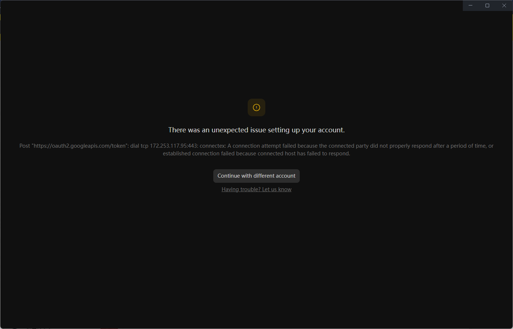](#network-config) | [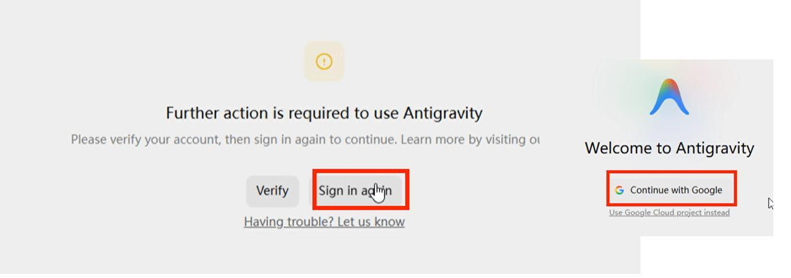](#human-verify) | [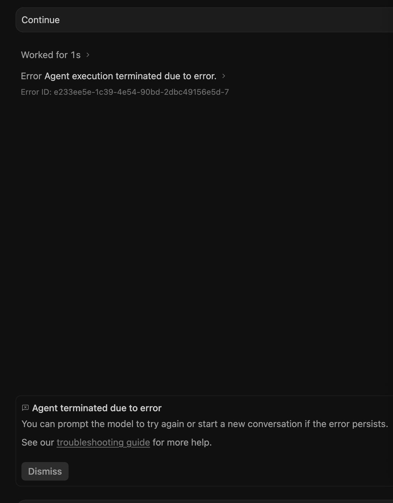](#faq-chat-400) | [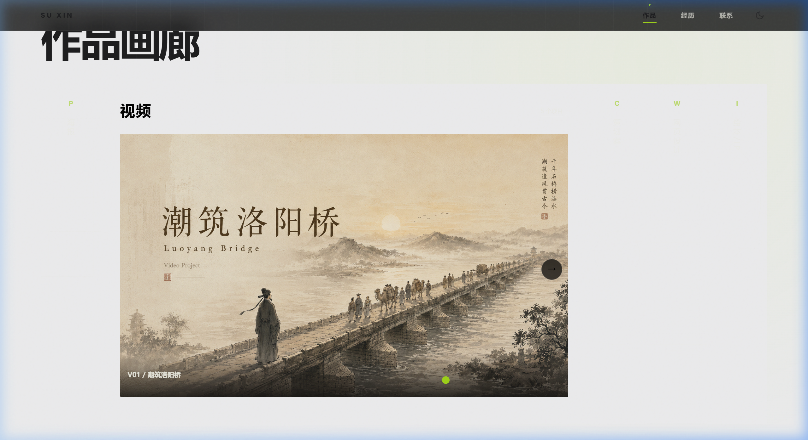](#faq-localization) |
| **Sorry, this account is ineligible** | **There was an unexpected issue setting up your account.** | **Further action is required** | **Agent execution terminated due to error** | **Antigravity IDE / 2.0 全中文设置** |
| [👉 点此处理地区/资格/年龄](#faq-auth-ineligible) | [👉 点此按第三章配置网络](#network-config) | [👉 点此查看扫码验证流程](#human-verify) | [👉 点此换纯净家宽/处理400](#faq-chat-400) | [👉 点此查看一键汉化教程](#faq-localization) |

> 💡 **怎么对号：**
> * **客户端全是英文 / 界面汉化**：2.0 运行开源一键注入脚本，IDE 安装微软官方语言包 → [👉 点此直达汉化指南](#faq-localization)。
> * **账号没资格**：优先查地区与资格，再查年龄认证（==不要先反复注入==）。
> * **unexpected issue / 网络超时**：就是客户端没真正走通代理——请按 **第三章网络配置** 处理（Tun / Antify 等）。
> * **Further action / 扫码验证**：登录阶段的人机验证，见扫码流程；**年龄认证**在「账号没资格」那一条处理。
> * **对话中断 / Agent terminated / 400 报错**：==100% 梯子 IP 被谷歌标记为受限地区==，请按 Q3 **换美/日纯净家宽 IP** 并彻底重启客户端 → [👉 点此直达排障（异常 3）](#faq-chat-400)。
> * 只想要原来 VS Code 界面：下载 **Antigravity IDE**，==不要只点官网最上面的 Antigravity 2.0==。
> * 发消息一直转圈、模型刷不出来：优先当网络未接管，==不要先反复注入账号==。

## 一、部署前的核心准备工作

在正式开始配置前，请务必确认您的软硬件环境满足以下基础条件：

1. **畅通的国际网络环境**：首要前提是您的本地网络已具备无障碍访问 Google 服务的条件（本指南默认您已掌握基础的代理工具使用方法）。
2. **状态正常的 Google 账号**：推荐使用订阅了 Gemini Pro/Ultra 的高级账号。普通免费账号可用于测试，但极易受限；若您的账号已出现 `403 Forbidden` 报错或处于封禁状态，将无法完成后续接入。

> 🚨 **【风控与防封号 · 必看】**
> 官方对于低价合租、非常规渠道代充的 Gemini 订阅账号打击力度极大（官方标准定价为 $20/月）。若您的订阅来源异常，随时面临被取消订阅的风险。
> 在日常使用中，==切忌频繁切换跨国/跨地区代理节点 IP==。IP 的剧烈波动是触发 Google 风控导致封号的最常见原因。==请固定使用长期稳定的优质节点==。

---

## 二、必看：先分清 Antigravity IDE 与 Antigravity 2.0

Google 更新后，Antigravity 已经拆成多个产品。请先确认自己正在使用哪一个客户端，否则界面截图、扩展入口和排障判断会对不上。

1. **Antigravity IDE**：这是原教程主要覆盖的 VS Code 风格客户端，有编辑器、侧边栏、扩展面板、SSH 等传统 IDE 结构。
2. **Antigravity 2.0**：这是新的独立桌面应用，官方定位更偏 Agent 项目管理与多 Agent 编排，已经不是 VS Code 那种界面。
3. **Antigravity CLI / SDK**：CLI 是终端工具，SDK 是开发者工具链，本篇不展开讲。

> **重要提醒：** 本教程继续覆盖 Antigravity IDE 与 Antigravity 2.0 的网络、登录、验证问题；扩展面板 / SSH / 界面位置默认以 **Antigravity IDE** 为准。2.0 用户请重点看网络接管、账号登录与扫码验证。

> **给老用户：** 旧版 Antigravity 更新后可能变成 2.0（官方产品方向，不是安装包坏了）。需要 VS Code 风格界面时，请安装或保留 **Antigravity IDE**。

官方下载入口：[https://antigravity.google/download](https://antigravity.google/download)。进入页面后不要只点最上面的 Antigravity 2.0，请向下找到 **Antigravity IDE** 区域，再选择 macOS 对应版本下载：

* Apple Silicon 芯片（M1/M2/M3/M4 等）：选择 **macOS - Download for Apple Silicon**。
* Intel 芯片 Mac：选择 **macOS - Download for Intel**。如果官网后续调整支持范围，请以下载页当前显示为准。

如果您只是想跟着本教程原来的截图操作，或者需要扩展面板、SSH、Antify 单应用规则，请优先安装 **Antigravity IDE**，不要误装成只面向新界面的 Antigravity 2.0。

**👀 最简单的辨别方法：看电脑「桌面」上的图标显示**
这里说的黑/白，是指 **桌面 / Dock / 启动台里的应用图标** 观感（图标底色偏浅还是偏深），**不是**软件窗口内部的深色/浅色主题。
* ⬜ **桌面图标整体偏白、浅色底**：一般是 **Antigravity 2.0**。
* ⬛ **桌面图标整体偏黑、深色底**：一般是 **Antigravity IDE**。

打开软件后还可再确认：IDE 接近 VS Code（侧边栏、扩展面板）；2.0 更像新的项目 / Agent 工作台。

---

## 三、必做：macOS 网络环境配置（二选一） {#network-config}

> ⚠️ **【重要特征识别 · 出现此报错必看本章】**
>
> 如果您在登录阶段遇到了如下图所示的 **`There was an unexpected issue setting up your account.`**，或提示 `oauth2.googleapis.com 连接超时` / `EOF` / `daily-cloudcode 请求失败`：
>
> * 🚨 **核心本质**：==100% 说明客户端根本没有走通代理网络==（浏览器能上外网不代表客户端已接管）。
> * ⚠️ **操作禁忌**：此时==千万不要反复注入账号或狂点登录==，必须先按本章配置好网络！
> 
> 

**原理解析：为什么不能直接连？**
Antigravity IDE 和 Antigravity 2.0 的底层网络请求都不会完整接管 macOS 的常规系统代理流量。这意味着即便您的浏览器能正常打开 Google 首页，客户端本体依然处于断网状态，直接导致登录弹出 `There was an unexpected issue setting up your account`。因此，必须通过虚拟网卡（Tun 模式）或 Antify 强制接管底层流量。

我们为您提供两套解决方案（==强烈推荐首选方案 A：Tun 模式==）：

### 方案 A：全局流量接管（Tun 模式虚拟网卡）—— 首选极简方案

开启代理工具的 Tun 模式（即在系统底层创建一张虚拟网卡），能强制电脑上的所有软件流量都走代理，这是目前最省心的方案。无论您使用 Antigravity IDE 还是 Antigravity 2.0，都建议优先尝试这个方案。

1. **开启 Tun 模式**：以主流的 **Clash Verge / Clash Verge Rev** 为例，请进入软件设置，**开启"虚拟网卡"或"Tun 模式"**（部分软件如 ClashX Pro 称之为"增强模式"），同时**关闭原本的"系统代理"**。右侧的分流模式请保持在"规则（Rule）"。
2. **环境净化与重启**：为了避免路由表冲突，请彻底退出电脑上正在运行的其他加速器、VPN 或多余的代理软件。重启您主用的代理工具，并使用浏览器打开 Google 首页测试。如果无法访问，说明虚拟网卡未能成功创建或存在路由冲突，请排查网络工具自身设置。
3. **修复权限（如遇报错）**：首次开启 Tun 模式时，macOS 通常会请求管理员密码以安装底层依赖。如果在软件内点击开启后无反应或报错，请寻找旁边类似"扳手"的图标，手动触发依赖项安装。

> **提示**：如果方案 A 在您的 Mac 上配置成功且能顺畅使用，请直接跳至 **【第四章：账号安全接入与验证流程】**。若由于系统冲突导致 Tun 模式无法启用，再尝试下方的方案 B。

### 方案 B：应用级强制分流（Antify + 系统代理）—— 进阶备用方案

如果您排斥使用全局虚拟网卡，希望实现更精准的单应用代理，可以通过 Antify 工具对 Antigravity 进行定点强制接管。

1. **基础代理设置**：在您的代理软件中，**关闭 Tun 模式**，**开启"系统代理"**，并确保模式依然处于"规则（Rule）"。
2. **获取并安装 Antify**：前往官网 https://antifyapp.com/zh 点击下载。下载后双击 `.dmg` 文件，将 Antify 拖入 `Applications（应用程序）` 文件夹完成安装。
3. **授予系统权限**：首次运行 Antify 引导至"下一步"时，系统会弹出需要修改网络设置的权限请求。请点击蓝色按钮跳转至 Mac 的"系统设置"，找到对应的网络扩展开关予以放行，并保存。
   * *排错：如果未自动跳转，请依次进入 Mac 的 `系统设置 -> 网络 -> VPN与滤网`，找到 Antify 并手动允许。*
4. **配置本地节点（Proxies）**：
   打开 Antify，点击左侧菜单的 `Proxies`，然后点击右侧的 `Add Proxy` 进行本地端口绑定。
   * **名称 (Name)**：自定义（如：Antigravity Proxy）。
   * **协议类型 (Type)**：根据您的代理工具选择（通常为 `HTTP` 或 `SOCKS5`）。
   * **服务器地址 (Server)**：填写本机回环地址 `127.0.0.1`。
   * **端口号 (Port)**：填写您代理软件提供的本地监听端口（若不清楚，可在 Mac 的 `系统设置 -> 网络 -> 代理` 中查看具体数值）。

```copy-dashboard
本机地址 (Server): 127.0.0.1
默认端口 (Port): 7897
备用端口 (Port): 7890
```

   * 保存配置，呈现如下状态：
   
   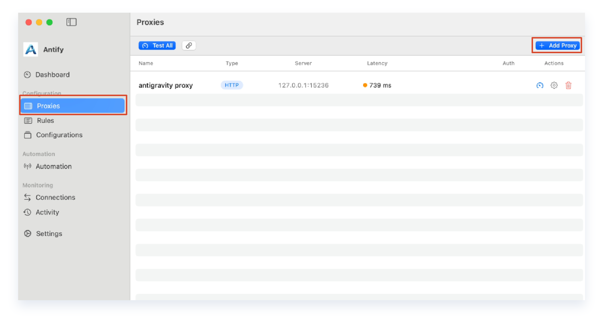 

5. **配置应用分流规则（Rules）**：
   点击左侧菜单的 `Rules`，选择 `Add Rule`。打开 Mac 的 Finder（访达），进入"应用程序"目录，将您实际使用的客户端图标直接拖入 Antify 界面中央的虚线框内。在 `Proxy Server` 下拉菜单中，选择您刚才创建的节点并保存。
   * 如果您使用的是 **Antigravity IDE**，请拖入 Antigravity IDE 对应的应用图标。
   * 如果您使用的是 **Antigravity 2.0**，请拖入 Antigravity 2.0 对应的应用图标。
   * 如果两者都安装且都会使用，建议分别添加两条规则，避免只代理了其中一个客户端。

   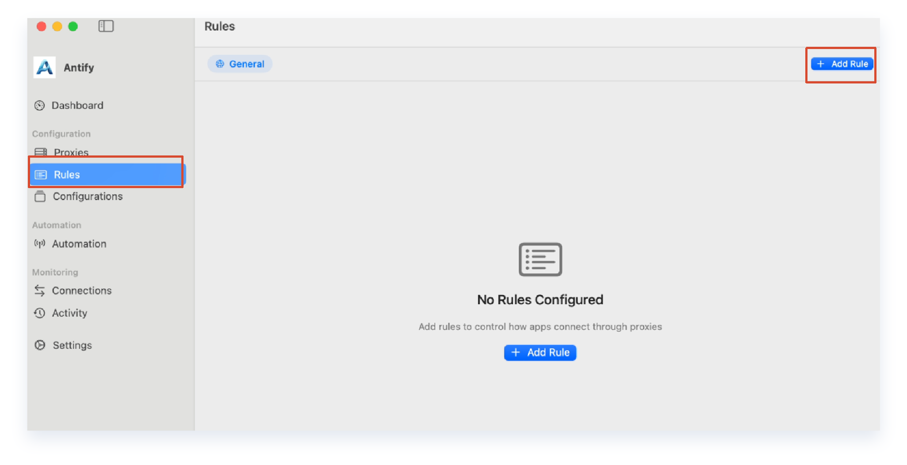 
   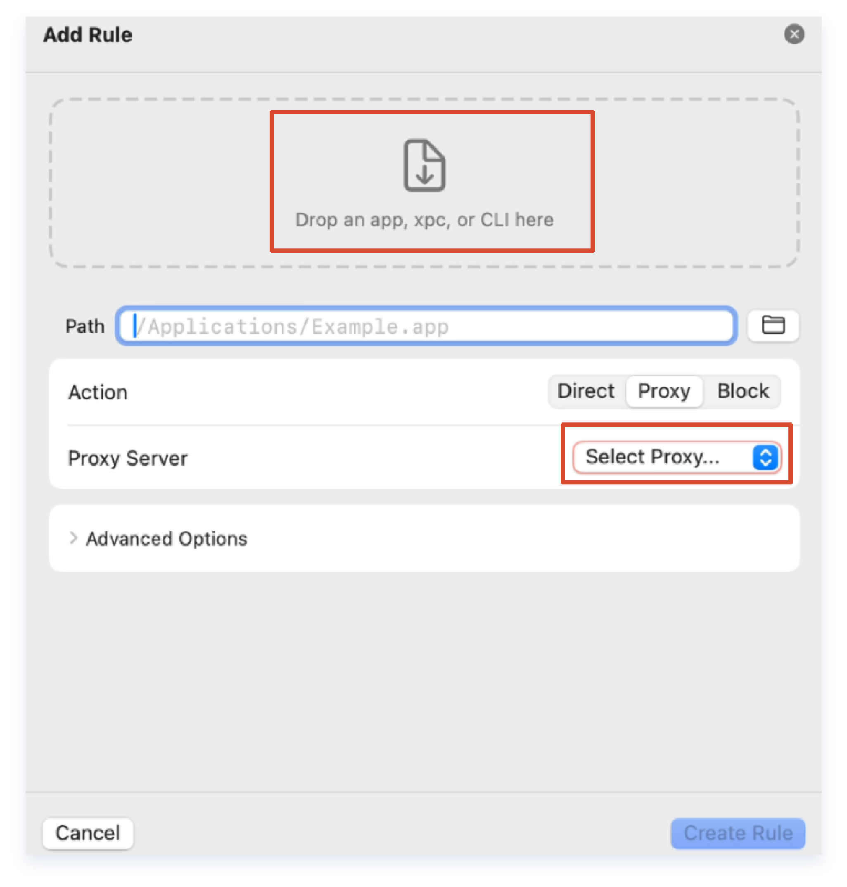 
   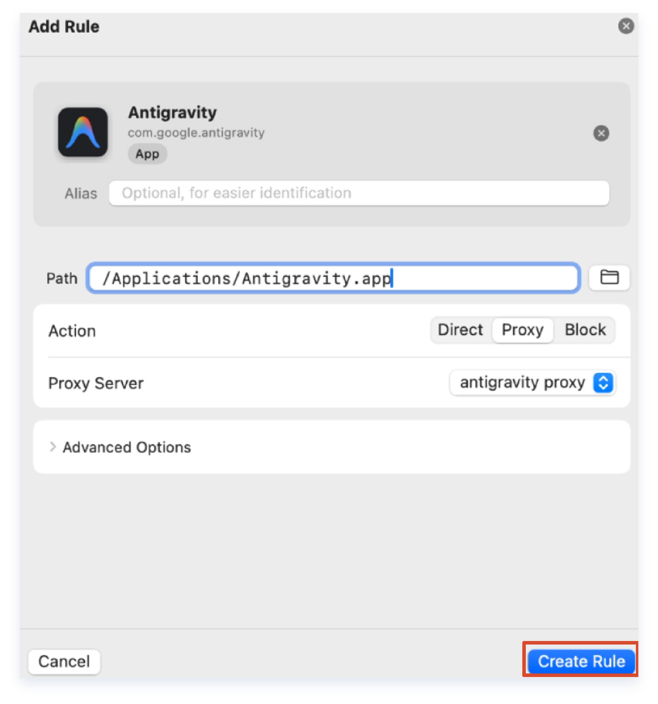 

6. **连通性校验**：回到 `Proxies` 界面，点击刚刚创建的节点左侧的 **测速 (Latency)** 按钮。若显示具体延迟毫秒数，证明链路已打通；若无反应，请仔细核对步骤 4 中的协议与端口号是否填错。
   > **⚠️ 核心注意**：采用此方案后，每次使用 Antigravity 时，都必须保持 Antify 软件处于后台运行状态。

---

## 四、账号安全接入与验证流程

网络基建完成后，我们将进行账号的绑定。受限于 Google 的安全策略，根据您的账号权重，可能会遇到不同的验证流程。

### 4.1 尝试标准网页授权

1. 启动您实际使用的应用程序：Antigravity IDE 或 Antigravity 2.0。
2. 软件会唤起您的默认浏览器，请按照网页引导，使用您的 Google 账号进行授权登录。
3. 若浏览器提示授权成功，且切回软件后能正常拉取到模型、进入项目或创建对话，说明标准登录通关。请直接跳至下方的 **【4.3 人机安全验证与扫码解锁】**（若登录阶段已弹出验证，也请按 4.3 处理）。

> **遇到阻碍？**
> 若授权网页白屏、无响应或频繁提示错误代码，请先分清是网络未接管、账号地区资格不通过，还是本地授权状态异常。请勿反复重试以免锁定账号；确认不是资格问题后，再采用下方的本地授权辅助方案。

> 如果点击登录后长时间没有任何反应，通常不是账号问题，而是 Antigravity 客户端请求超时，说明网络还没有真正接管到软件流量。请先停止反复点击登录，回到第三章检查 Tun 是否开启；如果使用 Antify，请确认 Antigravity IDE / Antigravity 2.0 应用本体已经加入规则，代理端口和代理类型也要对应正确。

### 4.2 进阶登录：Cockpit Tools 本地授权辅助

**【Cockpit Tools 现在的定位】**
目前官方风控严格，Cockpit Tools ==不再是用来绕过「账号没资格」的强登工具==。如果官方判定地区、年龄或资格不符，强行注入 Token 也无法绕过服务端校验。
它现在的主要价值是：**多账号切换 / 管理更方便**，以及处理浏览器跳转无响应、客户端状态错乱、本地授权写入失败等问题。请当作**本地授权辅助**，==不要指望它绕过官方资格校验==。

> 🔄 **新版工具说明：** 请从 GitHub Releases 下载**最新版**再操作（以页面最新包为准）。新版已对齐官方 **Antigravity IDE** 路径与相关 OAuth 状态读写。想沿用 VS Code 风格界面时请用 **Antigravity IDE**，不要和 2.0 混路径。

1. **下载工具**：访问 https://github.com/jlcodes99/cockpit-tools/releases ，在 `Assets` 中下载最新的 macOS **universal `.dmg`** 安装包。
   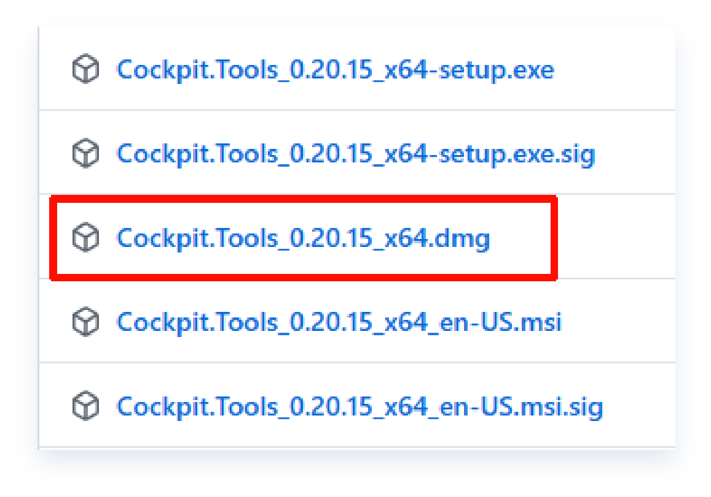 

2. **安装与安全放行**：将图标拖入"应用程序"完成安装。
    > **Mac 特别提示**：由于是第三方开发者工具，首次运行会被 Mac 拦截。请打开 `系统设置 -> 隐私与安全性`，向下滚动找到被拦截的 Cockpit 提示，点击"仍要打开"并输入电脑密码放行。
    > 
    > **💡 如遇“已损坏无法打开”提示（隔离放行）：**
    > 如果双击打开时，macOS 弹出“Cockpit Tools 已损坏，无法打开”的警告，这通常是 macOS Gatekeeper 安全隔离限制导致的，并不代表文件损坏。如遇此损坏提示，请按以下极简步骤处理：

**第①步**：请先确认您的 Cockpit Tools 是从上方官方 GitHub Releases 下载源下载的。

**第②步**：如果确认来源安全，请在 Mac 上打开 **“终端 (Terminal)”** 应用。

**第③步**：复制并粘贴执行下方提供的隔离放行命令（直接点击卡片右侧的“复制”即可）：

```command-dashboard
标题: macOS 隔离放行命令 - Cockpit Tools
说明: 如遇应用提示已损坏，请复制并在终端执行此命令
命令: sudo xattr -rd com.apple.quarantine "/Applications/Cockpit Tools.app"
```

*(提示：执行该命令时需要输入您的 Mac 锁屏密码。在输入密码时屏幕上不会有任何星号或字符显示，这是 Unix 系统的密码安全保密机制，直接盲输完并按回车键确认即可。)*

**第④步**：命令行执行完毕后，重新双击打开 Cockpit Tools 即可。

**第⑤步**：如果此时依然提示无法打开，再去 Mac 的 `系统设置 -> 隐私与安全性` 中，向下滚动找到 Cockpit 提示并点击“仍要打开”完成最终安全放行。


3. **初始化设置**：打开 Cockpit Tools，点击左下角的齿轮/设置图标，将界面语言切换为"中文"。
    

4. **绑定授权**：在左侧应用列表中选中 `Antigravity IDE` 或 `Antigravity` 图标。点击界面上方的"添加账号"（或蓝色的 `+` 号），选择 **"开始 OAuth 授权"**。新版 Cockpit Tools 的 Antigravity 集成主要面向官方 **Antigravity IDE**；如果您的目标是新式 Antigravity 2.0，请不要套用旧版 IDE 的截图和路径判断。随后在弹出的浏览器窗口中完成 Google 登录。
   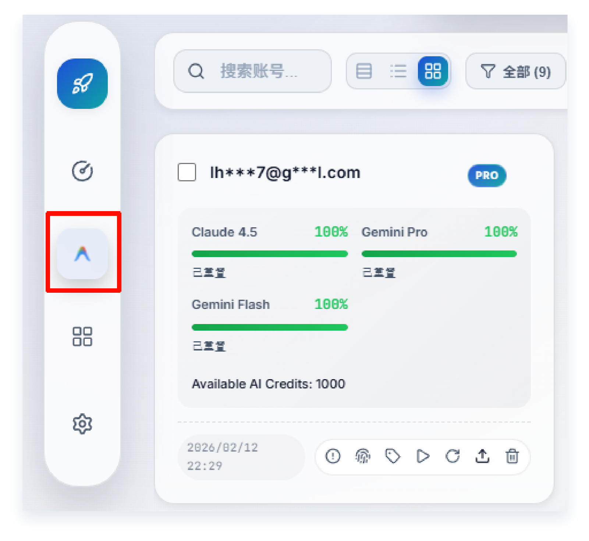 
    
   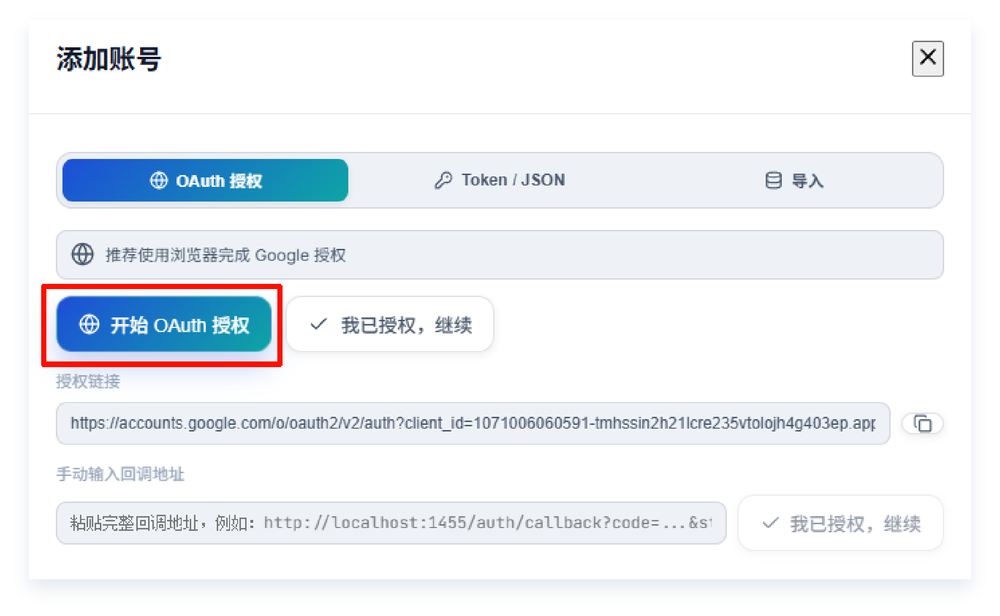 

5. **唤醒客户端**：授权成功后返回工具，在账号卡片下方点击 **"播放 (启动)"** 按钮。
   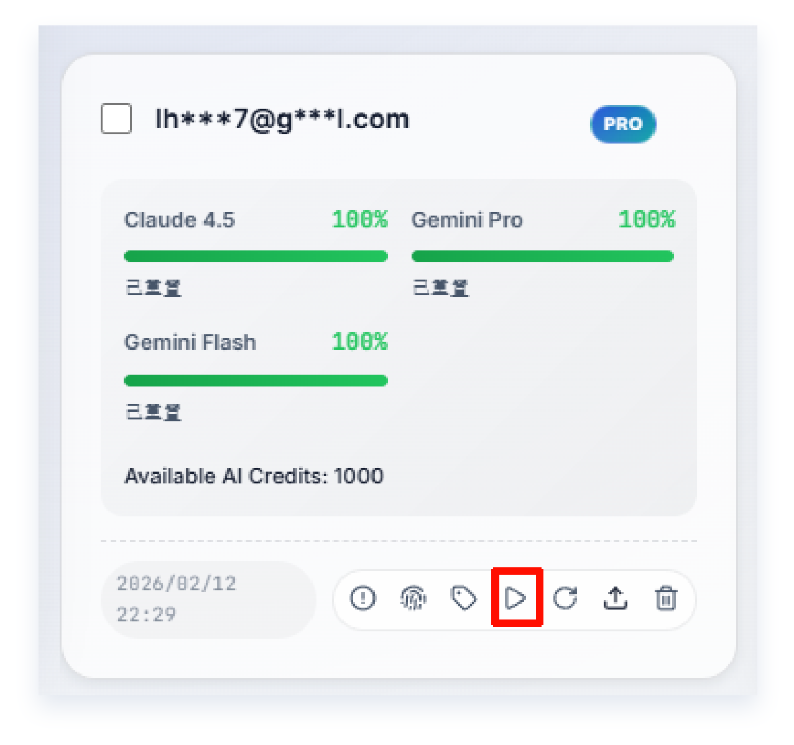 
   此时系统会弹窗提示"未找到应用程序路径"，请点击选择按钮旁边的 **刷新** 标识，随后点击 **保存**。新版 Cockpit Tools 已适配官方重命名后的 Mac 应用 `/Applications/Antigravity IDE.app`，也能从旧 macOS 路径配置迁移到当前路径。如果自动识别不准，请手动选择 **Antigravity IDE.app**。若您的目标是旧版 VS Code 风格界面，请不要误选成新的 Antigravity 2.0 应用。Antigravity IDE 将被强制唤醒或重启。
   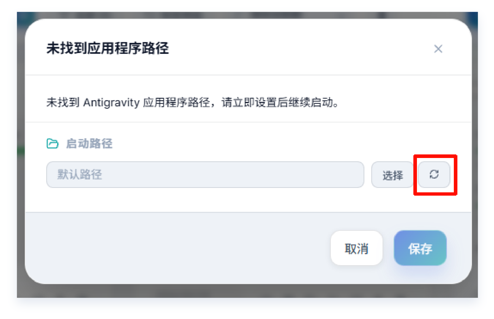 
   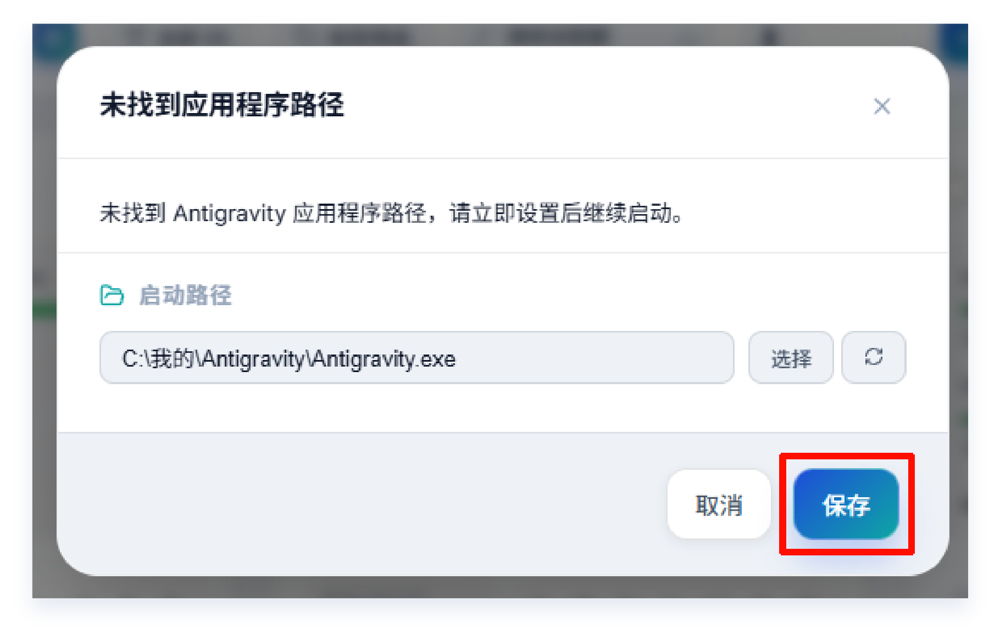 

6. **验证载入**：观察客户端界面。Antigravity IDE 通常会在顶部或右侧出现模型切换下拉菜单；Antigravity 2.0 则可能表现为可以正常进入项目、创建 Agent 或发起对话。只要账号状态能被识别并进入可对话状态，即代表本地授权状态写入成功。若仍提示没资格或认证错误，请按 FAQ 里的三类报错继续判断，不要反复强行注入。
   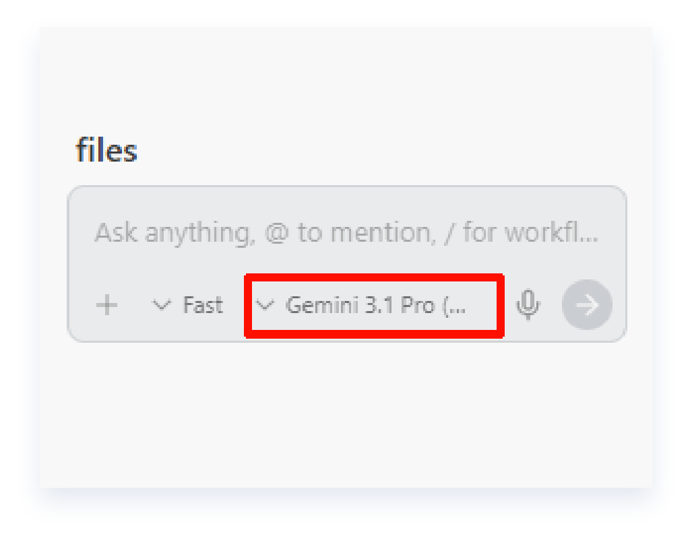 

### 4.3 人机安全验证与扫码解锁（必看） {#human-verify}

为对抗机器批量滥用，系统会进行二次核验。**现在不会等您登录进去再发消息才验证：多数情况下，登录授权阶段就会直接弹出验证要求。**

1. 登录时如果看到类似下图提示 `Further action is required to use Antigravity`，请点击 `Verify` 或 `Sign in again` 继续。

   

2. **验证双通道选择：推荐使用下方两种最可靠的方案**

---

### 💡 通道一（推荐）：谷歌云 Cloud Shell 短信验证通道（支持国内 +86 手机号）

> 🌟 **核心原理**：Antigravity 与谷歌云 (Google Cloud) 共享底层的身份验证系统。只要您的 Google 账号在谷歌云顺利完成手机号验证，Antigravity 即可**同步全自动过关**！该方法完整支持绑定中国大陆 (+86) 手机号接收验证码。

1. **访问谷歌云验证授权入口**：
   建议在浏览器打开**无痕模式**，访问：[https://docs.cloud.google.com/docs/authentication?hl=zh-cn&cloudshell=true#service_accounts](https://docs.cloud.google.com/docs/authentication?hl=zh-cn&cloudshell=true#service_accounts)。登录您的目标 Google 账号。

2. **激活 Cloud Shell 触发验证**：
   登录后刷新页面，==**第 1 步先点击页面右上角的 `[>_ Shell]` 图标按钮**==（见下图 1），页面底部才会弹出提示窗口；==**第 2 步点击弹窗中的 “激活 Cloud Shell” (Activate Cloud Shell) 蓝色按钮**==（见下图 2）。

   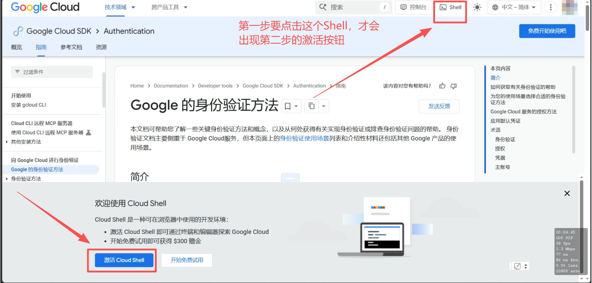

   

3. **选择填写手机号验证**：
   勾选同意授权点击下一步，系统会弹出验证界面。在验证选项中点击 **“Verify your phone number” (填写手机号验证)**。

   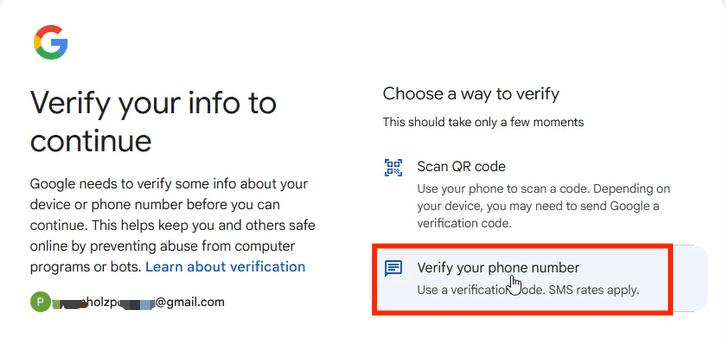

4. **输入国内手机号接收验证码**：
   点击国旗列表选择 **China (中国 +86)**，在输入框填入自己的国内手机号，点击 Next 接收并填入 6 位短信验证码完成验证。

   

   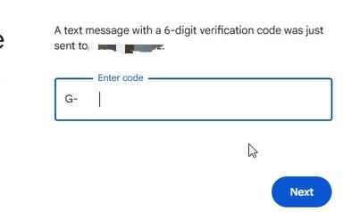

   > 📌 **手机号验证使用须知**：每个手机号仅可成功验证 Antigravity 一次。若您的国内手机号此前已验证过其他账号，请更换家人或朋友的号码，或使用短效接码工具配合接收。

5. **回到 Antigravity 重新登录**：
   谷歌云短信验证成功后，回到 Antigravity 客户端，直接点击 **`Sign in again`** 按钮重新登录，即可顺利成功进入反重力！

   
---

### 📱 通道二：手机 Google App 内置扫码（“焚决”打法）

1. **扫码前先对齐环境**：
   * 手机与 Mac 尽量使用**同一干净节点、同一出口 IP**。
   * 准备 Android / iOS 手机，安装并登录 **Google App**（安卓手机需开启“谷歌基础服务”），登录相同的 Google 账号。

2. **使用内置 Google Lens 扫码**：
   * 打开 Google App，点击搜索框右侧的**相机/镜头图标 (Google Lens)** 扫描 Mac 屏幕上的验证二维码（==不要用微信或普通相机扫==）。

   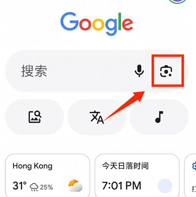

3. **手机端确认**：
   * 手机弹窗选择 **“是，继续”**。必须看到手机端屏幕最终显示 **“您现在已通过验证”** 才算真正成功！

   

4. **真假成功判定与死磕重试（“焚决”心法）**：
   * ⚠️ **真假成功判定**：手机扫码后，电脑网页无论显示“身份验证成功”还是“无法验证”，均不可作数！**必须且只有当手机屏幕最终显示“您现在已通过验证”** 时才算真正的成功。
   * 🔄 **无限重试原则**：若手机提示“回到原设备确认”或“无法验证你的信息”（代表失败），切勿放弃！直接在 Antigravity 客户端点击 `Sign in again` 刷新二维码，**反复重试扫码（连续重试 7 次以上）**。若多次尝试仍未成功，可更换代理节点或改用【通道一】。
   * 如果手机显示验证手机号或电脑显示失败，**切记不要放弃，连续多试几次（反重力点 Sign in again 重新扫码，反复试 7 次以上）**。若仍然不行，可尝试通道一。

---

### 🛡️ 补充工具：Antigravity Tools 开源账号管理（免第三方反代）

为保障账号安全，避免使用危险的第三方反代导致封号，推荐使用开源的 [Antigravity Tools (Antigravity-Manager)](https://github.com/lbjlaq/Antigravity-Manager/releases)。下载后只需通过官方 OAuth 授权，即可实现多账号本地安全一键管理与切换。

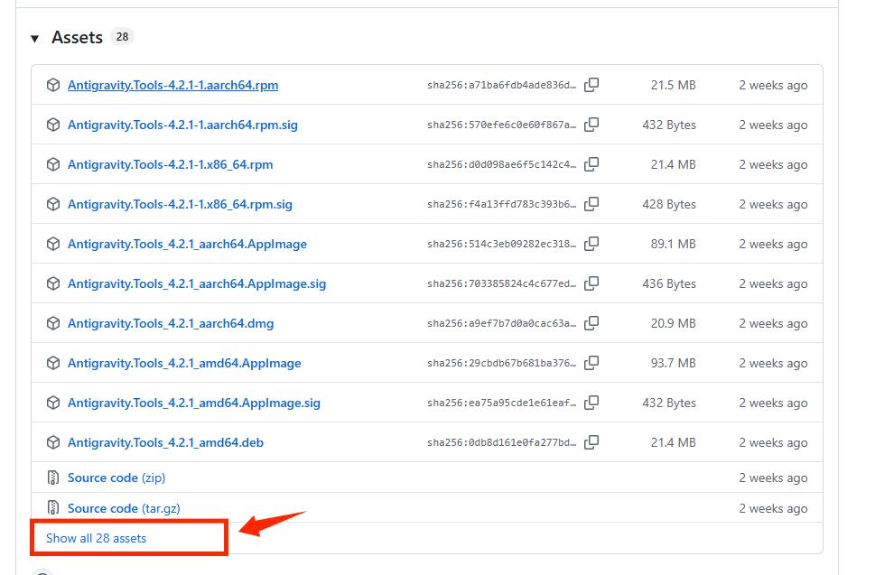

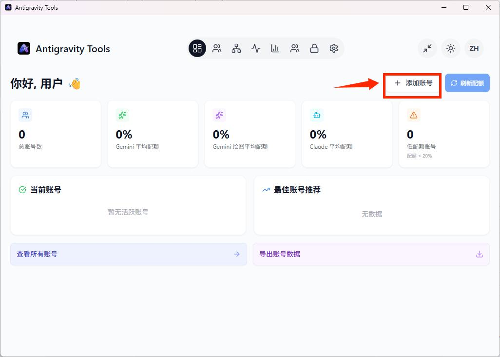


---

---

## 五、 界面汉化：Antigravity IDE 与 2.0 中文化指南 {#faq-localization}

很多用户反馈打开客户端后全是英文，不知道如何切换为中文界面。由于 **Antigravity IDE** 和 **Antigravity 2.0** 采用了完全不同的底层架构，两者的汉化方式不同，请根据您使用的版本选择对应的汉化方案：

---

### 🌟 方案一：Antigravity 2.0 界面汉化（开源一键 ASAR 注入补丁）

> 💡 **原理简介**：Antigravity 2.0 采用全新的 Electron 独立桌面架构，官方目前尚未在设置中内置语言切换选项。社区开发者开源了专用的汉化套件 [qqxpee/antigravity2-cn](https://github.com/qqxpee/antigravity2-cn)，基于 ASAR 物理层动态包注入机制，完美汉化软件主界面、系统菜单、任务栏托盘及设置面板，支持**一键极速安装**与**无损还原**。

#### 1. 下载汉化包
1. 访问开源项目页面：[qqxpee/antigravity2-cn (GitHub 官方仓库)](https://github.com/qqxpee/antigravity2-cn)

   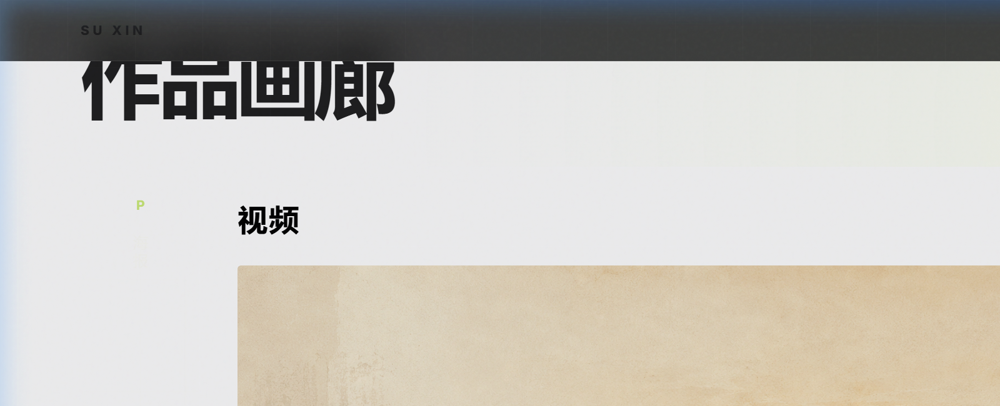
2. 点击页面右上角绿色的 **Code** 按钮，在下拉菜单中选择 **Download ZIP** 下载压缩包。
3. 将下载好的压缩包解压到您电脑本地任意文件夹（例如您的 `Downloads` 或 `桌面`）。

#### 2. 一键安装汉化
1. **完全退出** 正在运行的 Antigravity 软件（可在活动监视器中确认无后台残留进程）。
2. 打开刚才解压出来的 `antigravity2-cn` 文件夹，双击运行 **`双击安装中文汉化.command`**。
3. 终端黑框会弹出提示，按需输入数字选择左上角品牌名称展示方式：
   * `1`（默认推荐）：保留英文 `Antigravity` 官方品牌名，界面最协调。
   * `2`：隐藏左上角品牌文字。
   * `3`：显示中文品牌名 `反重力智能编程`。
4. 脚本执行完毕后，重新打开 Antigravity 2.0 软件，即可畅享全中文界面！

   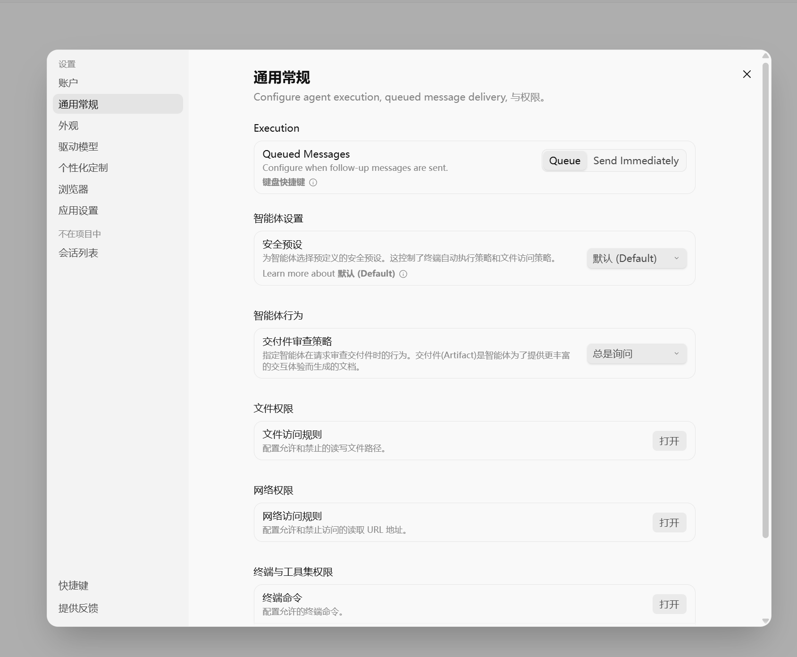

#### 3. 一键卸载与无痕还原官方英文
如果后续软件官方大版本更新，或者您想恢复官方原版英文：
1. 完全退出 Antigravity 客户端。
2. 回到 `antigravity2-cn` 文件夹，双击运行 **`双击卸载还原官方英文.command`**。
3. 软件即可瞬间恢复至官方原版英文状态，不留任何注入痕迹。

---

### 🌟 方案二：Antigravity IDE 界面汉化（官方 VS Code 简体中文语言包）

> 💡 **原理简介**：Antigravity IDE 基于 VS Code 框架构建，可以直接通过扩展市场安装微软官方维护的中文简体语言包。

#### 1. 安装微软官方语言包
1. 点击左侧边栏的 **扩展（Extensions）** 图标（快捷键 `Cmd+Shift+X`）。
2. 在顶部搜索框中输入 **`Chinese`**。
3. 找到并点击安装由 Microsoft 维护的 **`Chinese (Simplified) (简体中文) Language Pack for Visual Studio Code`**（插件标识符：`ms-ceintl.vscode-language-pack-zh-hans`）。

   

#### 2. 配置显示语言为简体中文
1. 按下快捷键 **`Cmd+Shift+P`** 调出顶部全局命令面板。
2. 在输入框输入 **`display`** 或 **`Configure Display Language`** 并按回车。
3. 在弹出的语言列表中，选择 **`zh-cn`（中文简体）**。
4. 右下角会提示需重启客户端生效，点击 **Restart** 重新启动 Antigravity IDE，即可完成全中文切换！

---

## 六、极客专属：SSH 远程开发配置（非必选）

> **技术建议**：本节主要面向 Antigravity IDE。Antigravity 2.0 已经是新的独立 Agent 桌面应用，不再是传统 VS Code 风格 IDE；如果您使用的是 2.0，请优先查看它自己的项目、权限和终端相关功能，不要强行套用旧版扩展面板截图。普通用户请直接跳过本节。

为解决 SSH 直连的网络穿透问题，请执行以下适配步骤：

1. **获取专属插件**：访问 https://open-vsx.org/extension/dinobot22/antigravity-ssh-proxy ，点击右下角紫色的 `Download` 下载 `.vsix` 扩展包。
2. **安装扩展**：打开 Antigravity，点击左侧边栏的"扩展"管理面板，将刚才下载的包直接拖拽进去完成离线安装。
3. **配置终端端口**：安装后，客户端底栏会多出一个绿色的 `ATP` 标识。点击它，在弹出的输入框内填入您本地代理工具的监听端口号并保存，随后再执行 SSH 服务器连接指令。
   > **网络逻辑闭环提醒**：如果您当前使用的是【方案B: Antify应用代理】，此处的 ATP 扩展可以直接生效。但如果您使用的是【方案A: Tun模式】，在进行 SSH 握手时，**必须同时勾选代理软件的"系统代理"开关（即 Tun 与系统代理双开）**。连接稳固后，方可关闭系统代理。
4. **远端注入**：在成功连接 SSH 的终端窗口侧边栏，再次进入"扩展"面板，找到类似 `在 SSH:XXX 中安装扩展` 的选项。手动为远端服务器环境安装 `Antigravity SSH Proxy`。
5. **生效**：彻底关闭并重启当前工作区窗口，SSH 代理链条即可完全贯通。

### 扩展市场加载慢 / 搜不到插件怎么办？

> 💡 **适用范围：** 这一段只针对 **Antigravity IDE** 的扩展面板。Antigravity 2.0 不是传统 VS Code 风格 IDE，请不要强行套用。

如果扩展面板默认提示正在使用 **Open VSX**，可能会出现插件搜索不全、下载很慢、甚至加载失败的情况。可以把扩展市场源切换为 VS Code 官方源。


操作方法：

1. 打开左侧 **扩展（Extensions）** 面板。
2. 如果页面提示 `By default, Antigravity uses Open VSX as a marketplace. This can be changed in Antigravity settings.`，点击里面的 **Antigravity settings**。

   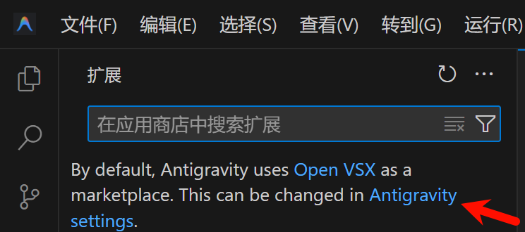

3. 在 `Editor -> Marketplace` 设置里，把下面两个地址分别填入对应输入框。

   

```copy-dashboard
Marketplace Item URL: https://marketplace.visualstudio.com/items
Marketplace Gallery URL: https://marketplace.visualstudio.com/_apis/public/gallery
```

   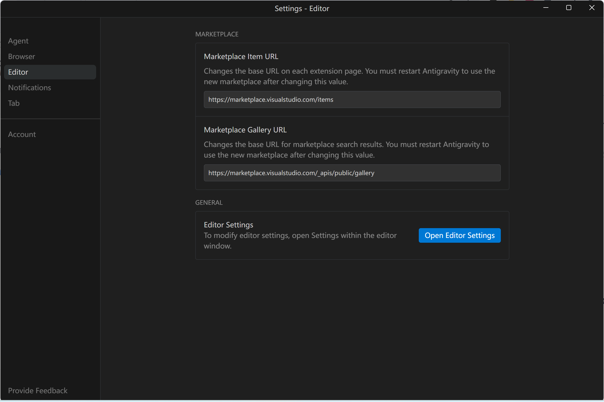

填完后，**彻底关闭并重新打开 Antigravity IDE**，再回到扩展面板搜索 `ssh`、`Remote - SSH` 等插件。正常情况下，搜索结果会切到 VS Code 官方插件市场，插件会更全，加载也更稳定。

---

## 七、遇到问题先看这里：常见疑难杂症 (Troubleshooting)

| 您看到的情况 | 优先判断 | 先看哪一段 |
| --- | --- | --- |
| 客户端全是英文 / 如何汉化为中文 | 2.0 使用开源注入脚本 / IDE 安装微软中文包 | [第五章：界面汉化](#faq-localization) |
| 打开后不是 VS Code 那种界面 | 装成了 Antigravity 2.0，或旧版更新到了 2.0 | 异常 0 |
| `Sorry, this account is ineligible to use Antigravity` | 账号地区/资格/年龄/订阅问题 | 异常 0.5 的账号没资格 |
| `There was an unexpected issue setting up your account.`、登录一直转圈 | 网络没真正走代理 | **第三章网络配置**（亦可看异常 0.5 的 OAuth 说明） |
| `There was an error with your authentication` | 本地授权状态或 Token 状态异常 | 异常 0.5 的认证错误 |
| 点击登录后接近 1 分钟没反应 | 客户端请求超时，网络没接管 | 异常 1 / 第三章 |
| 发消息一直转圈、按钮一直灰 | 网络未接管或节点不可用 | 异常 1 |
| 模型列表/模型名称刷不出来 | 节点异常或 Tun / Antify 方案冲突 | 异常 2 |
| Cockpit Tools 不知道选 IDE 还是 2.0 | 新版主要对齐 Antigravity IDE | 异常 2.5 |
| 蓝色 `Retry`，同时有 `400` | 先看报错正文再分流 | 异常 3 |
| 报错里出现 `code: 400` 且含 `User location is not supported` | 当前出口地区/节点不被 API 支持 | [异常 3 地区 400](#faq-chat-400) |
| 验证成功后仍反复出现 `Verify / Sign in again` | 年龄验证或客户端登录状态未刷新 | 异常 4 |
| 大字报错 `There was an unexpected issue setting up your account.` | 节点/登录状态/超时等综合问题 | 异常 5 |
| 提示“您的身份无法被核实” / 需 Pixel 安全码 | 节点 IP 不够纯净 / 异地登录风控 | 异常 6 |
| 扩展市场搜不到插件 | 默认 Open VSX 源不稳定 | 第五章扩展市场 |

### 异常 0：打开后不是 VS Code 界面，为什么和教程截图不一样？
* **原因**：Antigravity 2.0 是新的独立桌面应用；原教程截图更接近 Antigravity IDE，也就是旧版 VS Code 风格客户端。
* **对策**：网络接管、登录、扫码验证仍可参考本教程；但扩展、SSH、侧边栏位置、模型下拉框位置可能不同。若您需要原来的 IDE 体验，请确认自己安装的是 Antigravity IDE。

### 异常 0.5：登录报错先按这三类判断 {#faq-auth-triage}

现在 Antigravity 的登录校验比旧版更严格，不建议一看到失败就反复用 Cockpit Tools 注入。请先按截图判断类型：

<a id="faq-auth-ineligible"></a>

1. **提示账号没资格：优先处理地区/账号资格**

   如果看到 `Sorry, this account is ineligible to use Antigravity`，这通常不是普通 Token 写入问题，而是账号资格、地区、年龄认证或官方准入校验没有通过。

   

   ==处理顺序（请按此先后）：先「地区与资格」，再「年龄认证」。不要先反复注入。==

   **处理建议 1（优先）：检查地区与资格**

   先检查 Google 账号地区、付款资料地区、订阅状态和当前代理节点地区是否一致。此类问题目前不能再简单理解为“Cockpit 强制注入即可解决”；必要时只能调整地区环境或更换符合资格的账号。

   1. **查验反重力官方支持地区**：  
      访问反重力官方 FAQ 页面：[https://antigravity.google/docs/faq](https://antigravity.google/docs/faq)，可查阅反重力当前支持的全部账号国家/地区列表（如 Taiwan、Singapore、Japan、South Korea、United States 等）。

      

      > 💡 **核心判定法则（非常重要）：**  
      > ==如果您的账号地区已经在官方支持列表中，但登录时仍显示“账号不符合资格 (ineligible)”，说明问题不在地区，而是需要进行「年龄认证」！请直接看下方的【处理建议 2】。==

   2. **修改账号关联地区（若当前地区不在支持列表中）**：  
      如果页面提示 `Sorry, this account is ineligible to use Antigravity`，且账号关联的是不支持地区，请按以下步骤申请修改：

      - **第 1 步：查验账号当前关联地区**  
        打开 Google 服务条款页：[https://policies.google.com/terms](https://policies.google.com/terms)，滑动到页面最底部，查看该账号当前关联的国家/地区（如显示中国大陆、中国香港等受限地区则需修改）。

        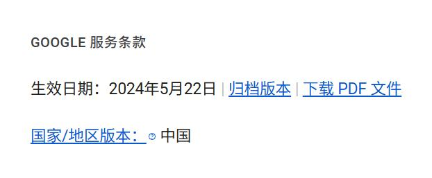

      - **第 2 步：打开地区修改申请表单**  
        访问 Google 官方地区更改申请表单：[https://policies.google.com/country-association-form](https://policies.google.com/country-association-form)。

        

      - **第 3 步：选择目标地区与提交方案**  
        * **方案 A（快捷通过）**：在列表中选择您代理节点最常用的地区（如日本、新加坡、英国、加拿大等），勾选 **“我居住在此”** 并直接提交。
          
          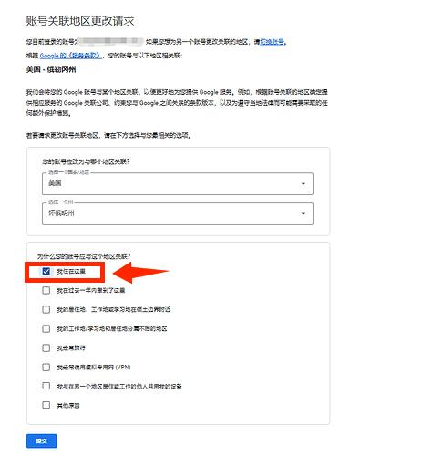

        * **方案 B（申诉说明）**：若选择最后一个 **“以上都不是”**，可在留言框说明：“*我因工作需要用到 Gemini / Antigravity，请帮我更改账号地区到 xxx*”。

      - **第 4 步：生效确认与年限提醒**  
        🚨 **【极重要提醒】**：==Google 账号地区修改每年仅允许申请一次！一旦修改成功，一年之内不允许再次修改。请务必确认好目标地区再提交！== 提交后等待邮件通知（通常 24 小时内生效），生效后再重新登录 Antigravity。

      如果你确实长期在美国居住或工作，可以参考以下英文申诉模板：

```text
Due to work arrangements, I am currently residing and working in the United States for an extended period. In order to better access local services (including payment methods, app downloads, and region-specific content), I would like to change my account region to the United States.

I have stable internet access and regularly use devices within the U.S., and I also use local payment methods for transactions. Therefore, I kindly request to update my account region to the United States to ensure a smooth user experience.

Thank you for your understanding and support.
```

   **处理建议 2（其次）：人脸自拍年龄认证（解决 Verify -> Sign in again 无限循环）**

   如果网页提示“身份验证成功”，但回到反重力点击 `Sign in again` 后**仍无限循环弹出 Verify 要求**，100% 是因为账号没有通过 18 岁以上年龄认证！

   * **第 1 步**：访问 Google 官方年龄认证专属页：[https://myaccount.google.com/age-verification](https://myaccount.google.com/age-verification)。
   * **第 2 步**：推荐选择 **“Take a selfie / 自拍人脸识别”**（比提供信用卡或上传身份证更简单且成功率最高）。

     

   * **第 3 步**：页面生成二维码或 Link 链接，复制链接或手机扫码在手机浏览器完成刷脸（实测一张脸可无限次刷通过，手机与 Mac 需挂同一代理节点）。

     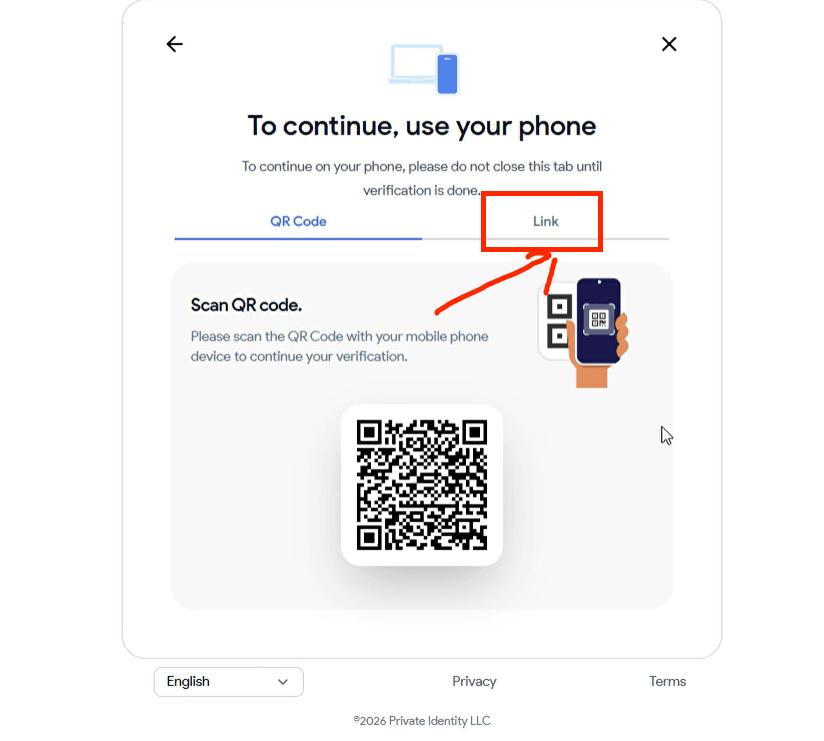

   * **第 4 步**：当手机显示 **“Your age is verified”** 年龄验证成功后，回到 Antigravity 再次点击 `Verify` $
ightarrow$ `Sign in again` 重新登录即可直接解决循环问题！

     

<a id="faq-oauth-network"></a>

2. **提示 `There was an unexpected issue setting up your account.`：优先修网络**

   如果看到大字报错 `There was an unexpected issue setting up your account.`，下方可能还带有 `Post "https://oauth2.googleapis.com/token"`、`connectex`、`failed to respond`、`connection attempt failed` 等详细信息，说明客户端请求 Google OAuth token 接口时没有走通网络。

   

   处理建议：回到第三章检查 Tun 是否真的开启、代理节点是否可用；如果使用 Antify，请确认 Antigravity IDE / Antigravity 2.0 应用本体已经加入规则。这个问题的重点是“网络没走上代理”，不是账号没资格。

   如果表现为点击登录后等待接近 1 分钟仍没有任何反应，也按网络问题处理：先不要继续重试，优先回查第三章网络配置、代理软件开关、Antify 规则和端口类型。

3. **提示认证错误：再考虑 Cockpit 本地授权辅助**

   如果客户端里显示 `There was an error with your authentication. To log in, click here`，更像是本地授权状态、Token 写入或客户端认证状态异常。

   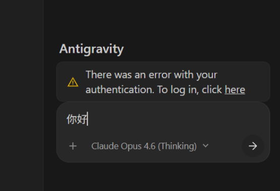

   处理建议：可以使用 Cockpit Tools 重新完成 OAuth 并写入本地状态。但新版官方仍可能继续检测账号资格、地区和 Token 状态，所以 Cockpit 只能作为本地授权辅助，不保证绕过官方服务端校验。

### 异常 1：登录无反应 / 消息发送后一直转圈
* **诊断**：典型的客户端断网表现，网络接管彻底失败。
* **对策**：请按顺序处理：
  1. 先切换一个干净稳定的代理节点，优先选择日本、新加坡等常用地区。
  2. 从头复盘 **第三章 macOS 网络环境配置**，确认 Tun 真正开启；如果使用 Antify，请确认应用规则、代理端口和代理类型都填对。
  3. 如果您当前使用的是 Antigravity 2.0，且反复无回复，可以换成 **Antigravity IDE** 试一次常规登录和对话。

正常连通的标志是：消息发送几秒后，右下角的发送图标会变成"带红色方框的停止生成按钮"或进入生成状态。

### 异常 2：模型刷不出来 / 对话无限加载卡死
* **诊断**：网络处于半连接状态，通常是代理节点自身网络不稳，或分流规则发生了内耗冲突。
* **对策**：首先尝试切换一个更干净的代理节点；若无效，请彻底放弃当前使用的网络接管方案，改用本教程中的另一套方案重置网络环境（例如：由 Tun 模式切换为 Antify 模式）。换方案前请先退出 Antigravity 和代理工具，避免 Tun 与 Antify 规则同时叠加造成底层冲突。

### 异常 2.5：Cockpit Tools 更新后，应该选 IDE 还是 2.0？
* **先下载最新版**：请从 [Cockpit Tools Releases](https://github.com/jlcodes99/cockpit-tools/releases) 下载最新安装包（以页面显示版本为准）。
* **新版改善**：新版会识别 `/Applications/Antigravity IDE.app`，并读写官方相关 OAuth 状态，**多账号切换/导入**更贴近官方客户端。
* **排错重点**：需要 VS Code 风格界面时，请选择 **Antigravity IDE**。若工具自动识别到 2.0，但您想跟本教程截图操作，请手动切回 IDE。
* **提醒**：部分版本附带 Codex 相关能力，与 Antigravity 登录不是一回事。

### 异常 3：蓝色 `Retry` / Agent execution terminated due to error / HTTP 400 {#faq-chat-400}

对话时如果发送消息后右下角报错 `Agent execution terminated due to error`，或出现蓝色 `Retry` 按键，点击 `Copy debug info` 复制报错详情：


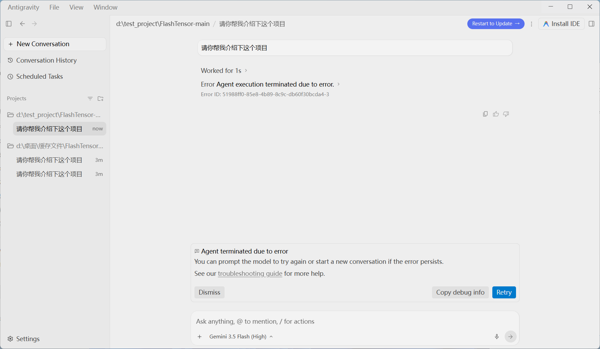

如果复制出的报错信息中包含类似如下代码：

```text
Trajectory ID: 3522b9cf-69be-4d6b-9a4e-d94529be73bd
Error: HTTP 400 Bad Request
Sherlog: 
TraceID: 0xd0732eb5227e8b44
{
  "error": {
    "code": 400,
    "message": "User location is not supported for the API use.",
    "status": "FAILED_PRECONDITION"
  }
}
```

<a id="faq-user-location-400"></a>

#### 🚨 核心本质原因：
**出现此报错 100% 是梯子/网络节点的问题！**  
因为 **Google 会定期更新全局 IP 数据库**，许多机场节点或公共数据中心 (Datacenter) 的 IP 会被 Google 官方自动标记判定为中国大陆或不受支持地区。即便是您的浏览器能够正常打开 Google 首页，Antigravity API 后台请求仍会被服务端直接拦截并弹窗提示 `User location is not supported`。

#### 💡 解决方案与排错步骤：
1. **更换纯净家宽 IP (Residential IP)**：强烈建议换用美区或日区纯净度更高的**家宽/住宅 IP 节点**。您可在 [ping0.cc](https://ping0.cc) 或 [ippure.com](https://ippure.com) 测试当前节点的 IP 纯净得分（避免使用已被污染的大陆机场节点）。
2. **换节点后彻底重启客户端**：更换纯净节点后，**务必彻底退出 Antigravity（包含活动监视器中的后台进程）** 再重新打开软件，重新发起对话测试。
3. **保持节点固定**：请固定使用长期稳定的优质节点，切忌在对话过程中频繁切换跨国 IP，避免再次被系统判定风控。
4. 若换多个纯净节点仍报 `User location is not supported`，请再检查 **Google 账号关联地区**（详见 [异常 0.5 账号没资格](#faq-auth-ineligible)）。

> 💡 一眼口诀：==看见 `Agent execution terminated` 或 `400` + `User location is not supported` → 100% 梯子节点 IP 被封锁，换纯净家宽/干净节点并重开客户端！==
#### 其他导致 Retry / 发消息失败的常见原因

若不是上面的 location 文案，再按下面排查：

1. **年龄限制（常见于新号）**  
   Cockpit 角标红色 `unknown` 时，优先：https://myaccount.google.com/age-verification（建议人脸；证件备选；不建议银行卡硬验）。

   

2. **多开/历史登录残留**  
   统一用 Cockpit Tools 规范切号/重登。

3. **Gmail 附属服务冲突（少见）**  
   非 Gmail 主号后来又开通附属 Gmail，偶发身份错乱时可在 Google 账号设置中检查并移除不再使用的 Gmail 服务。

4. **普通 400 / 节点不稳（没有 location 那句时）**  
   换日本、新加坡等节点，退出客户端重登；长期不行考虑换订阅/换代理工具。

5. **多套网络方案叠加**  
   Tun 与 Antify 不要同时硬叠。只留一套后再测。

6. **账号已被严控/封禁**  
   以上都试过仍各种 Retry，再考虑换干净账号测试。

### 异常 4：验证成功后仍反复出现 `Verify / Sign in again`

如果浏览器已经显示身份验证成功，但返回 Antigravity 后仍提示 `Further action is required`，或者点击 `Sign in again` 后再次回到 Verify 页面，请按下面顺序处理：


1. 先确认 Google 账号的年龄验证已经真正完成，而不是只完成了二维码设备确认。
2. 完全退出 Antigravity，包括活动监视器中的后台进程，再重新打开。
3. 点击 `Sign in again` 或 `Continue with Google`，使用刚刚完成验证的同一个 Google 账号重新授权。
4. 如果仍然循环，清理浏览器中错误账号的登录状态，确认默认浏览器登录的是目标账号，并等待几分钟后再试。
5. 仍无法通过时，再使用 Cockpit Tools 重新完成一次 OAuth；Cockpit 只能刷新本地授权状态，不能替代官方年龄和地区资格校验。

### 异常 5：出现 `There was an unexpected issue setting up your account.` (EOF / invalid_grant / 超时)

只要界面出现大字报错 `There was an unexpected issue setting up your account.`，均属于本条排查范围：


**故障根因与精准排查方案：**
1. **`EOF` (`...onboardUser: EOF` / connectex)**：
   * **根因**：节点质量太差、网络严重不稳定或未被 Tun 模式完全接管。
   * **解决**：开启代理软件的 **Tun 模式 (全局接管)**，切换至质量更高的美区/日区纯净节点，关闭并重新打开 Antigravity，点击 `Continue with different account` 重新登录。
2. **`invalid_grant`**：
   * **根因**：账号的 OAuth 登录 Token 状态失效过期。
   * **解决**：点击 `Continue with different account` 重新走一遍授权流程即可。
3. **`context deadline exceeded`**：
   * **根因**：请求响应超时。检查本地代理设置并换节点重试。

---

### 异常 6：提示“您的身份无法被核实 / 我们无法验证您的身份”（或需 Pixel 安全码风控）

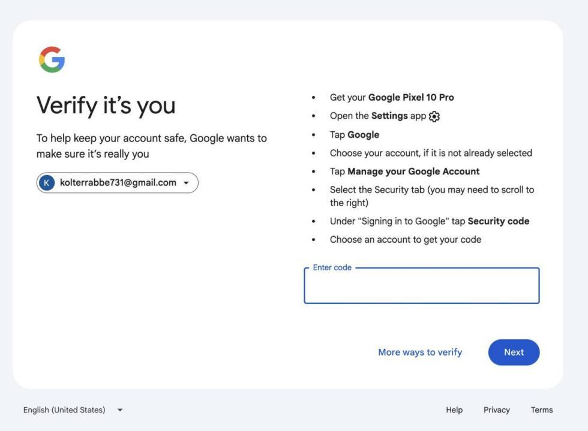

* **原因**：账号检测到异地登录或频繁变动出口 IP，触发了 Google 底层风控。
* **三招避坑与解决方案**：
  1. **检测并更换美区纯净 IP**：在登录前访问 [ping0.cc](https://ping0.cc) 或 [ippure.com](https://ippure.com) 检测代理节点的 IP 纯净度得分。**强烈推荐使用美区纯净家宽 (Residential IP)**，实测换为美区家宽节点后，隔天即可成功登录通关。
  2. **7 天固定设备养号法**：保持固定电脑设备与固定纯净节点，连续使用 Google / Gemini 满 7 天，系统会自动将其升级为受信任的“常用设备”，风控自动解除。
  3. **开通 Google 账户家庭组共享 Pro**：若有自己主号开通的 Pro，可通过家庭组邀请该账号加入共享会员（[邀请教程](https://ikunlove.best/gem)），直接用自己的主账号登录 Antigravity，彻底规避异地风控问题。

> 补充：少数日志里会出现连接中断、授权过期、请求超时等字样，本质仍多半是**网络不稳 / 登录状态失效 / 超时**，按上面四步处理即可。

---

## 八、技术支持与结语

如果您**严格按上述流程操作**，绝大多数情况下登录与使用问题都能解决。按教程把网络、环境、步骤做对，**正常可用是大概率事件**；若仍然用不了，多半是**账号自身异常**或**操作步骤有偏差**，而不是教程“没用”。对电脑不太熟练的用户，也可以直接联系客服下单**远程协助**，由专业人士一对一处理。若您的环境特别复杂（企业网管、多 VPN 叠加、权限策略等），更适合走远程个案排查。感谢您的支持！

- **教程持续更新保证**：软件或官方风控规则发生变动时，本教程会**第一时间同步更新最佳解决办法**，确保您始终能查阅到最新、最有效的排障指南。
### 售后群怎么用
- 扫码加入售后群后，**群里消息大家都能看见、都可以回复**，有问题直接在群里发即可。
- **闲鱼私聊请不要发敏感词**（例如违规引流、敏感平台名等），否则对方可能无法回复，问题会卡住。需要细聊技术细节，优先进售后群。

### 扫码验证：有时要看一点「运气」
人机扫码**不是 100% 人人一次过**。有的号环境都对了仍过不去，带一点运气成分，常见两类情况：
1. **账号本身权重/状态偏弱**，天生难过这一关；
2. **之前扫码次数太多**，已经触发 Google 风控。

若属于风控：==建议先停手，等待大约 7 天或更长（常见还有约一个月）再试==，期间狂扫往往没用。  
教程能帮你把网络、环境、步骤做对；**过不过还和账号与风控有关**，请先按教程排查，再判断要不要远程。

### 退款与远程协助（请务必看清）

**温馨提示：**

1. **问题出在账号本身**（环境与步骤已按教程排查完毕，确认为账号资格、风控、权重等自身原因）：教程已提供完整思路，并已协助排查，**此类情况不支持退款**。
2. **您认为账号没有问题**、更希望一对一排查：可以找我做**远程协助**。若远程仍未能解决，**会为您全额退款**。
3. 远程费用约定：已付的**教程款可抵作远程费用**，一般只需**补差价**（以当时约定为准）；远程成功后按远程服务结算。
4. **教程类虚拟内容**原则上售出后不退不换；上述「远程不成全退」是针对**远程服务兜底**，请与「账号自身问题不退」区分清楚。

对操作不熟、时间紧的用户，直接联系客服约远程即可。有问题先扫码进群说明现象；需要远程或核对退款条件，在群里或约定渠道联系。

### 售后群二维码


